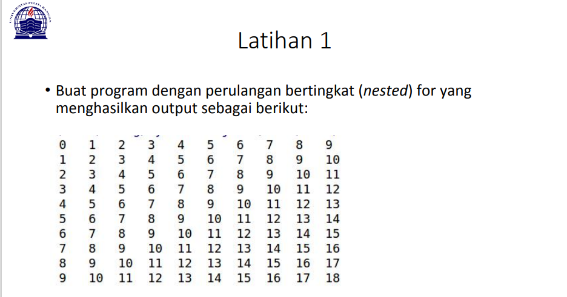
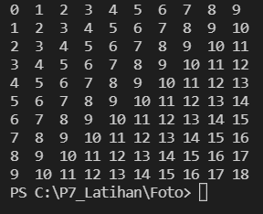

# P7_Latihan

Pada saat ini saya ditugaskan untuk membuat program perulangan bertingkat berikut contoh gambar yang ditugaskan 




Pada tugas pertama, saya di minta untuk membuat program perulangan bertingkat (nested) yang menghasilkan output seperti syntax dibawah 
````python
    for i in range(10) :
        for m in range(10) :
            n = i +m
            if(n<10):
                print(n, end="  ")
            else:
                print(n, end=" ")
        print()
````

Pada syntx tersebut kita membutuhkan baris dan kolom maka sebelum memasukan syntx diatas kita perlu menambahkan baris dan kolom seperti ini 

````python
    for i in range(10) :
        for m in range(10) :
````
Jika sudah memasukan kolom dan baris dengan menggunakan syntx diatas dan sekarang mencoba hasil membuat program perulangan bertingkat yang tugas tersebut 



Dan sampai sini kita selesai membuat program perulangan bertingkat dan bisa melanjutkan tugas selanjut nya. 

# LATIHAN 2


Tugas kedua yang di berikan oleh Dosen untuk mencari nnilai yang bernominal dibawah 0,5 Maka saya menggunakan syntx seperi berikut 
````python
    import random
    print(40*"=")
    print("Bilangan random yang lebih kecil dari 0,5")
    print(40*"=")
    jum = int( input("Masukan nilai n : "))
    i = 0
    for i in range(jum):
        i += 1
        angkaDec = random.uniform(0, 0.5)
        print("Data ke", i, " = ", angkaDec)
````